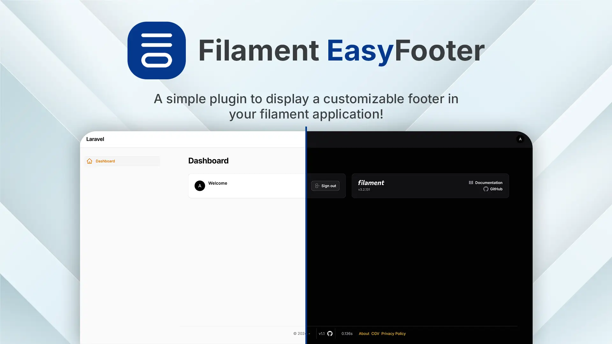

#  Filament EasyFooter





[](https://packagist.org/packages/devonab/filament-easy-footer)
[](https://github.com/devonab/filament-easy-footer/actions?query=workflow%3Arun-tests+branch%3Amain)
[](https://github.com/:vendor_slug/:package_slug/actions?query=workflow%3A"Fix+PHP+code+styling"+branch%3Amain)
[](https://packagist.org/packages/devonab/filament-easy-footer)


The Filament Custom Footer Plugin provides an easy and flexible way to add a fully customizable footer to your FilamentPHP application. This plugin integrates seamlessly with Filament's admin interface, enabling you to enhance your application's user experience with a professional and branded footer.
## 📦 Installation

---

You can install the package via composer:

```bash
composer require devonab/filament-footer
```

You can publish and run the migrations with:

```bash
php artisan vendor:publish --tag="filament-footer-migrations"
php artisan migrate
```

You can publish the config file with:

```bash
php artisan vendor:publish --tag="filament-footer-config"
```

Optionally, you can publish the views using

```bash
php artisan vendor:publish --tag="filament-footer-views"
```

This is the contents of the published config file:

```php
return [
];
```

## 🗒️ Usage

---

To start using this plugin, simply add it to the Filament provider's plugin array.

```php
$filamentFooter = new Devonab\FilamentFooter();
echo $filamentFooter->echoPhrase('Hello, Devonab!');
```

## 🧪 Testing

---

You can run the test with this command

```bash
composer test
```

## Changelog

Please see [CHANGELOG](CHANGELOG.md) for more information on what has changed recently.

## Contributing

Please see [CONTRIBUTING](.github/CONTRIBUTING.md) for details.

## Security Vulnerabilities

Please review [our security policy](../../security/policy) on how to report security vulnerabilities.

## Credits

- [ Devonab](https://github.com/Devonab)
- [All Contributors](../../contributors)

## License

The MIT License (MIT). Please see [License File](LICENSE.md) for more information.
